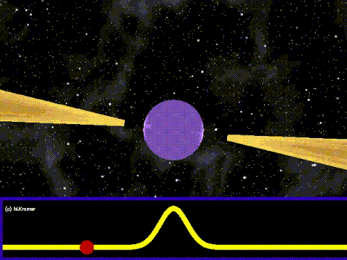

# pulsar-classification
Binary Classification of Cosmic Radio Signals: Pulsar Star Identification via Decision Trees (Edge AI Approach)

## 🌌 Overview & Business Value
Modern radio telescopes and deep-space receivers capture terabytes of data per second. The vast majority of these signals consist of cosmic background noise or human-made Radio Frequency Interference (RFI). 

This project aims to develop a lightweight Machine Learning model capable of autonomously distinguishing genuine **Pulsar Stars** from background noise. 
Designed with an **Edge AI** philosophy, this algorithm is meant to be translated into low-level code (C/C++) and deployed on embedded microcontrollers onboard satellites. By classifying and filtering out noise directly in orbit, we can drastically reduce downlink bandwidth requirements, lowering operational costs and optimizing deep-space communication pipelines.

## 📊 The Dataset
The model is trained on the **HTRU_2 Dataset** (High Time Resolution Universe Survey). It contains 17,898 instances of radio signals summarized by 8 statistical features extracted from two main observations:
1. **Integrated Pulse Profile:** The fundamental shape of the radio pulse.
2. **DM-SNR Curve:** The Dispersion Measure and Signal-to-Noise Ratio curve, representing how the signal dispersed while traveling through the interstellar medium.

For both observations, the extracted continuous features are: *Mean, Standard Deviation, Kurtosis, and Skewness*.
* **Target Variable:** `target_class` (0 = Noise/RFI, 1 = Real Pulsar).

## 🎯 Task, Model & Engineering Approach
* **Paradigm:** Supervised Learning
* **Task:** Binary Classification
* **Core Model:** Decision Tree Classifier (Information Theory Approach)

A **Decision Tree** was explicitly chosen over complex black-box algorithms (like Neural Networks) for two strict engineering constraints:
1. **Extremely Low Computational Cost:** Perfect for hardware with limited power budgets.
2. **Total Interpretability (White-Box):** The tree's splits, calculated via *Shannon Entropy* and *Information Gain*, allow us to extract explicit physical rules.

## ⚙️ Methodology & Architecture
The project is structured into a rigorous end-to-end pipeline:

1. **Exploratory Data Analysis (EDA):** Correlation matrices proved physically that the *Kurtosis* and *Skewness* of the integrated profile are the strongest predictors of a genuine pulsar.
2. **Class Imbalance Strategy:** Real pulsars make up only ~9% of the dataset. Therefore, standard *Accuracy* is considered a flawed metric. The evaluation heavily prioritizes **Recall** for the Pulsar class to minimize False Negatives (missing a real scientific discovery).
3. **Pre-Pruning & Training:** The tree is constrained with a `max_depth` parameter to prevent overfitting on the majority class and keep the final generated logic gates as short as possible.
4. **Benchmarking:** The custom Decision Tree is benchmarked against a `DummyClassifier` (Baseline) and a `RandomForestClassifier` (State-of-the-Art). 

## 🏆 Key Findings
The final benchmark yielded an unexpected and highly successful result: the single, lightweight Decision Tree actually **outperformed the complex Random Forest in Pulsar Recall** (~86% vs ~84%). 
Due to the Random Forest's feature subsampling and conservative majority-voting mechanism on highly imbalanced data, the single tree proved to be a more aggressive and capable classifier for hunting the minority class, proving that "bigger" is not always better in specialized Edge AI tasks.
